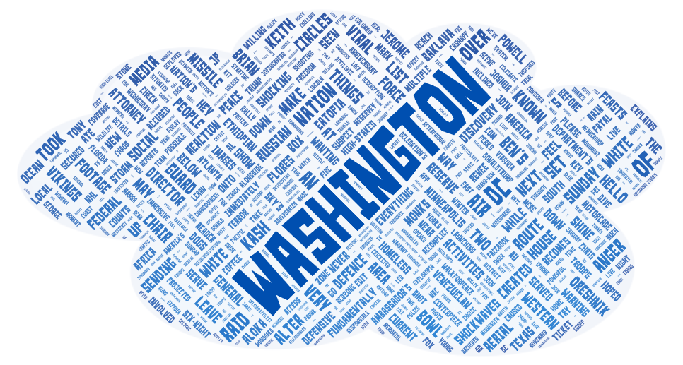
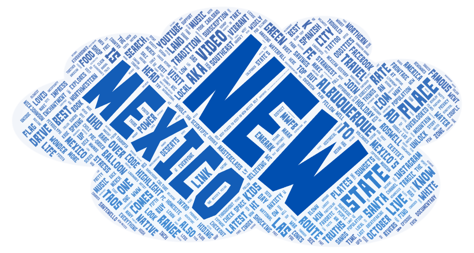
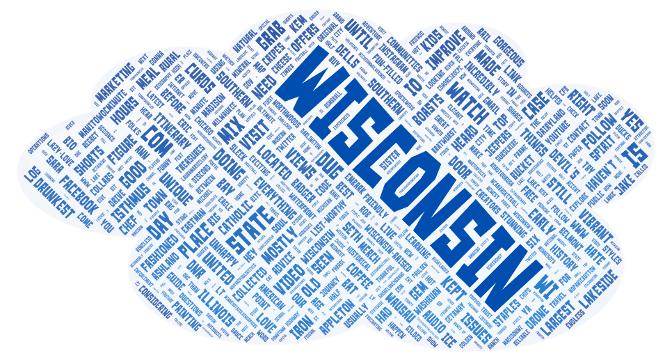

# geog458-lab2
Lilian Law

---

### **Reflection:**
For this lab, my topic was states I have lived in and I chose to use the three search queries "washington", "new mexico", and "wisconsin". 

These three states have signficance to me as I have lived in those three very different states, and are a part of my story. Additionally, the reason I chose these three locations and wanted to make this comparison was to see if only news reports would show or if info about the states would show in the results and word clouds, or if results about the people or culture in those states or other if something else would show up in the resulting searches and word clouds. For this reason I also chose to omit the word "state" from my search queries.

In the word clouds, the similiarties I saw were... I saw... (discuss if about news or not and such and common words)

The reasons for .. pattern showing between the three word clouds might be .... 

In the future my research on this topic could be improved by searching the terms on Yelp, Google, or other search engines or sites as this could give different results, and potential more as well instead of just videos. This would mean using Google or Yelp's APIs accordingly. Certain platforms such as yelp are also better for specific things to search such as resturants or stores, where as Google is good for general searches. This is another thing to keep in mind for future research on the topic I chose or if a similar exercise is done in the future. 

What stood out to me was ... I was surprised about... 

---

### **Word Clouds:**

**Washington Word Cloud**

**New Mexico Word Cloud**

**Wisconsin Word Cloud**

---

### **Spreadsheet View and Download Google Drive Links:**

**Spreadsheet of Search Results For:**
- Washington: [https://drive.google.com/file/d/1lzdG2b9Gx5zt1rtiXvM4jt9OGklwmbZ6/view?usp=drive_link](https://drive.google.com/file/d/1lzdG2b9Gx5zt1rtiXvM4jt9OGklwmbZ6/view?usp=drive_link)
- New Mexico: [https://drive.google.com/file/d/1MsB7Sb4hyUfjGmN2i3GKb3X4Xnzt132Y/view?usp=drive_link](https://drive.google.com/file/d/1MsB7Sb4hyUfjGmN2i3GKb3X4Xnzt132Y/view?usp=drive_link)
- Wisconsin: [https://drive.google.com/file/d/1bbZoo59igoH9yauf-yaDs2LGR-N66FAs/view?usp=drive_link](https://drive.google.com/file/d/1bbZoo59igoH9yauf-yaDs2LGR-N66FAs/view?usp=drive_link)

